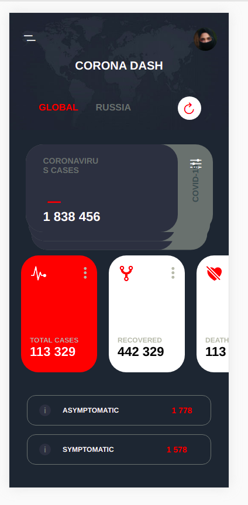
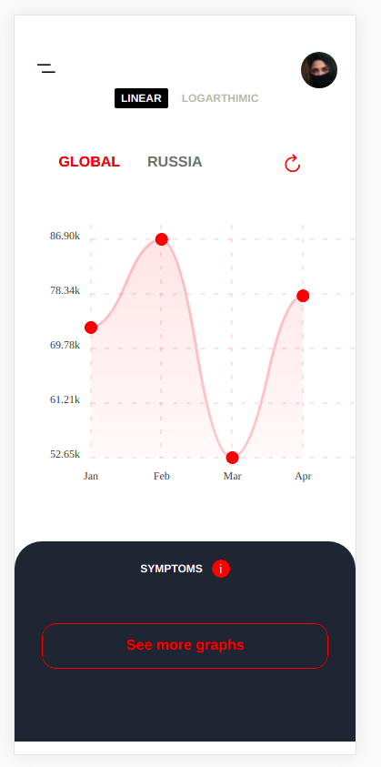
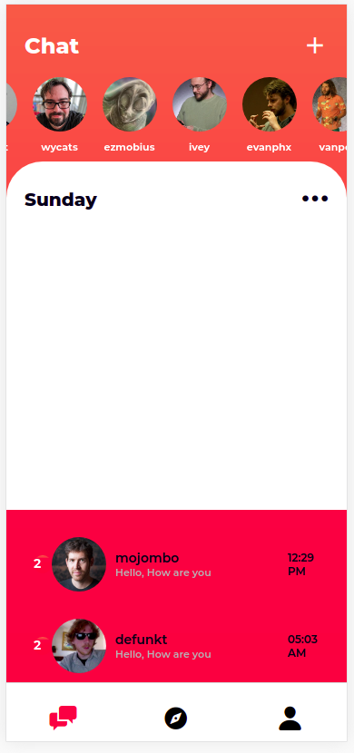
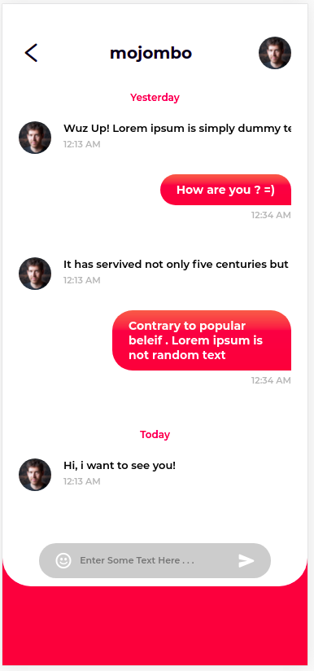

<!--
*** Thanks for checking out the Best-README-Template. If you have a suggestion
*** that would make this better, please fork the repo and create a pull request
*** or simply open an issue with the tag "enhancement".
*** Thanks again! Now go create something AMAZING! :D
***
***
***
*** To avoid retyping too much info. Do a search and replace for the following:
*** kunalkumar007, react-native-projects, kunal.developer, kunalinbox83@gmail.com, React Native Projects, Here you will find all the projects made by me.
-->

<!-- PROJECT SHIELDS -->
<!--
*** I'm using markdown "reference style" links for readability.
*** Reference links are enclosed in brackets [ ] instead of parentheses ( ).
*** See the bottom of this document for the declaration of the reference variables
*** for contributors-url, forks-url, etc. This is an optional, concise syntax you may use.
*** https://www.markdownguide.org/basic-syntax/#reference-style-links
-->

[![Contributors][contributors-shield]][contributors-url]
[![MIT License][license-shield]][license-url]
[![LinkedIn][linkedin-shield]][linkedin-url]

<!-- PROJECT LOGO -->
 

  

  <h3 align="center">React Native Projects</h3>

  

    Here you will find all the projects made by me.
     
    <a href="https://github.com/kunalkumar007/react-native-projects"><strong>Explore the docs »</strong></a>
     
     
    <a href="https://github.com/kunalkumar007/react-native-projects">View Demo</a>
    ·
    <a href="https://github.com/kunalkumar007/react-native-projects/issues">Report Bug</a>
    ·
    <a href="https://github.com/kunalkumar007/react-native-projects/issues">Request Feature</a>
  

<!-- TABLE OF CONTENTS -->

  
<h2 style="display: inline-block">Table of Contents</h2>

  <ol>
    <li>
      <a href="#about-the-project">About The Project</a>
      <ul>
        <li><a href="#built-with">Built With</a></li>
      </ul>
    </li>
    <li>
      <a href="#projects" >Projects</a>
        <ul>
          <li><a href="#Spides" >Spides</a></li>
        </ul>
        <ul>
          <li><a href="#protoswipe" >protoSwipe</a></li>
        </ul>
    </li>
    <li><a href="#contributing">Contributing</a></li>
    <li><a href="#license">License</a></li>
    <li><a href="#contact">Contact</a></li>
  </ol>

<!-- ABOUT THE PROJECT -->

## About The Project

[![Product Name Screen Shot][product-screenshot]](https://www.kunalkumar007.github.io/)

 Illustration by <a href="https://icons8.com/illustrations/author/5c07e68d82bcbc0092519bb6">Icons 8</a> from <a href="https://icons8.com/illustrations">Ouch!</a>

Here I am showcasing my all Projects that I have built over the time till now. All these projects are based on React. Hope you like it.

Why I Created this Repository.

Here's why:

-   Your time should be focused on creating something amazing. A project that solves a problem and helps others
-   You shouldn't be doing the same tasks over and over.
-   You should element DRY principles to the rest of your life :smile:

### Built With

-   react-native-cli
-   expo

<!-- GETTING STARTED -->

## Getting Started

To get a local copy up and running follow these simple steps.

<!-- PROJECTS -->

## Projects

Here I have listed all the projects.

### Spides

A Corona Virus App for all.

### ProtoSwipe

A Dating App using github API.

<!-- CONTRIBUTING -->

## Contributing

Contributions are what make the open source community such an amazing place to be learn, inspire, and create. Any contributions you make are **greatly appreciated**.

1. Fork the Project
2. Create your Feature Branch (`git checkout -b feature/AmazingFeature`)
3. Commit your Changes (`git commit -m 'Add some AmazingFeature'`)
4. Push to the Branch (`git push origin feature/AmazingFeature`)
5. Open a Pull Request

<!-- LICENSE -->

## License

Distributed under the MIT License. See `LICENSE` for more information.

<!-- CONTACT -->

## Contact

Instagram - [@kunal.developer](https://instagram.com/kunal.developer) - kunalinbox83@gmail.com

Project Link: [https://github.com/kunalkumar007/react-native-projects](https://github.com/kunalkumar007/react-native-projects)

<!-- ACKNOWLEDGEMENTS -->

<!-- MARKDOWN LINKS & IMAGES -->
<!-- https://www.markdownguide.org/basic-syntax/#reference-style-links -->

[contributors-shield]: https://img.shields.io/github/repo-size/kunalkumar007/react-native-projects?style=for-the-badge
[contributors-url]: https://github.com/kunalkumar007/react-native-projects/graphs/contributors
[license-shield]: https://img.shields.io/github/license/kunalkumar007/react-native-projects?style=for-the-badge
[license-url]: https://github.com/kunalkumar007/react-native-projects/blob/main/LICENSE
[linkedin-shield]: https://img.shields.io/badge/-LinkedIn-black.svg?style=for-the-badge&logo=linkedin&colorB=555
[linkedin-url]: https://linkedin.com/in/kunalkumar007
[product-screenshot]: ./images/banner.png
